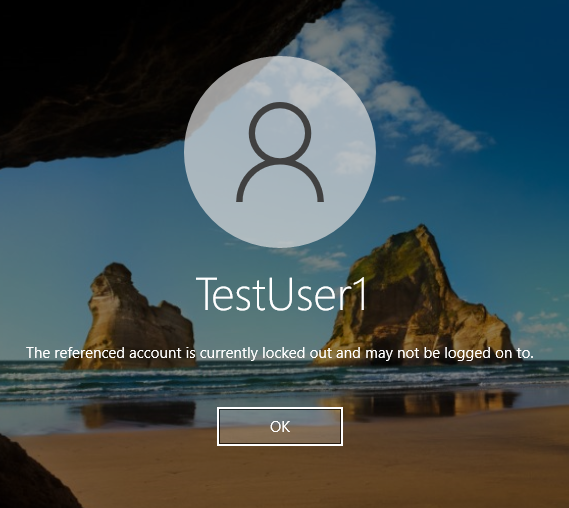
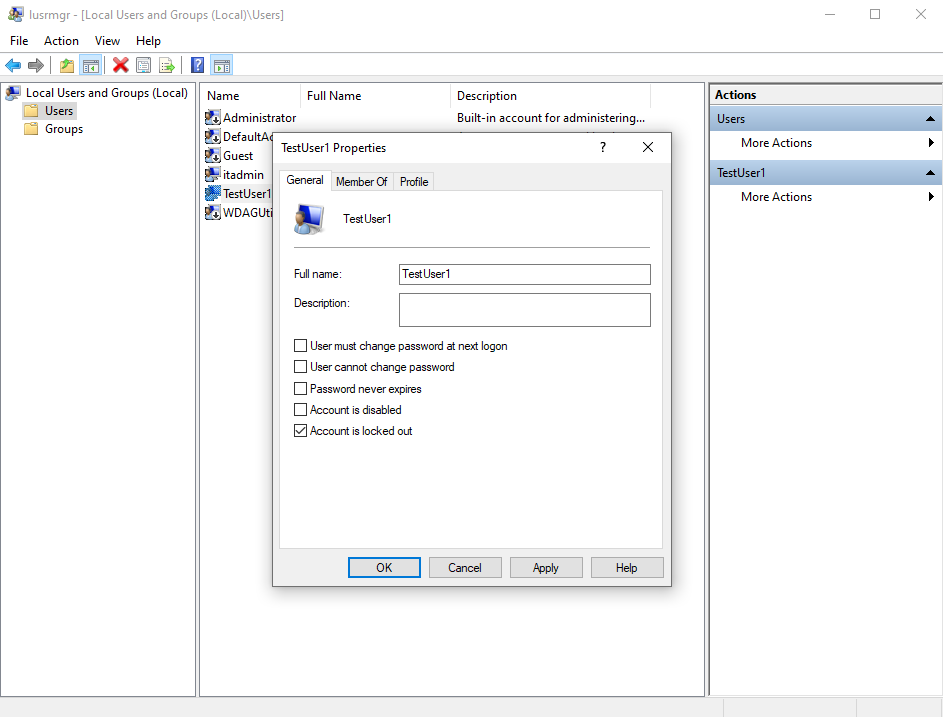
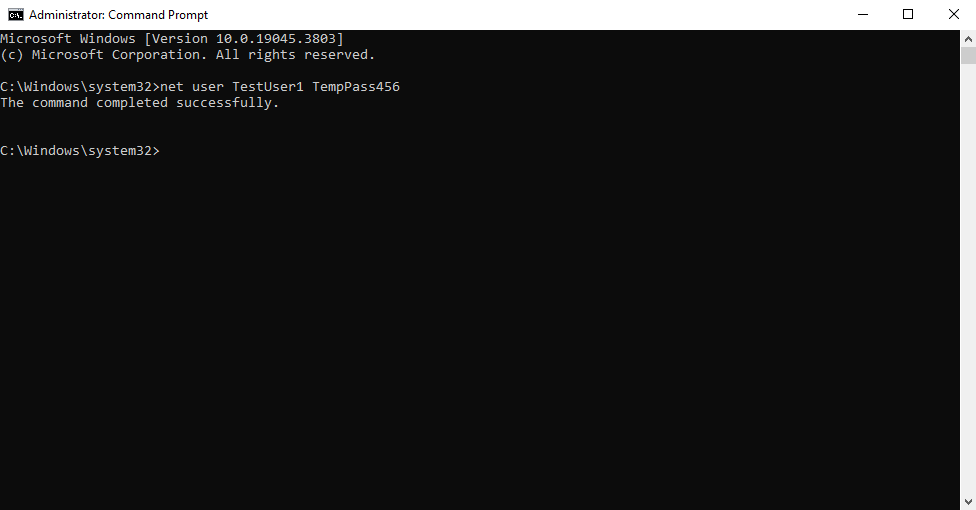

# Account Lockout — Troubleshooting Lab

## Scenario
A user reports being unable to log in after repeated “Incorrect password” attempts.  
Eventually, the account becomes locked.

## Symptoms
- User unable to log in  
- “Incorrect password” errors  
- “Account is locked out” in user properties  
- Failed logon events in Event Viewer  

---

## Step 1 — Reproduce the Issue (Lockout)
I intentionally attempted incorrect passwords several times to trigger a lockout on `TestUser1`.

### Screenshot — Account Lockout Message


---

## Step 2 — Check Event Viewer for Failed Logon Attempts
Using Event Viewer:

1. Opened Event Viewer (`eventvwr.msc`)  
2. Navigated to **Windows Logs → Security**  
3. Found failed logon attempts (Event ID 4625) associated with the test user  

### Screenshot — Event Viewer (4625 Failed Logon)


---

## Step 3 — Inspect User Status in Local Users and Groups
Used Local Users and Groups (`lusrmgr.msc`) to check the account status.  
The account correctly showed **“Account is locked out.”**

### Screenshot — User Properties (Locked Out)


---

## Step 4 — Unlock the Account & Reset Password
The lockout was cleared by resetting the password using Command Prompt (Admin):
```cmd
net user TestUser1 TempPass456
```

This simultaneously unlocks the account and assigns a temporary password.

### Screenshot — Password Reset (net user)


---

## Step 5 — Verify Successful Login
Once unlocked and reset, I logged in successfully using the temporary password.

### Screenshot — Successful Login


---

## Root Cause
Too many incorrect password attempts triggered the lockout threshold, preventing authentication until the account was reset.

---

## Resolution Summary
✔ Identified failed logon attempts in Event Viewer  
✔ Confirmed lockout status in Local Users and Groups  
✔ Unlocked account by resetting the password via Command Prompt  
✔ Verified login with new temporary password  

---

## Tools Used
- Event Viewer  
- lusrmgr.msc (Local Users and Groups)  
- Command Prompt (Admin)  
- Windows Login Screen  

---

## Notes
This lab demonstrates how a Tier 1 IT Support professional handles user lockouts, validates system logs, and restores access quickly and safely.


